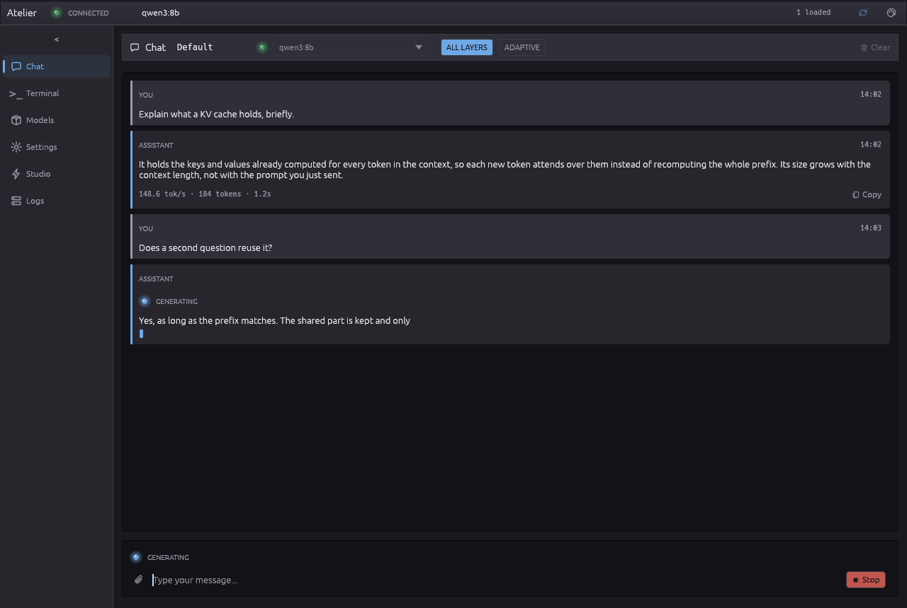
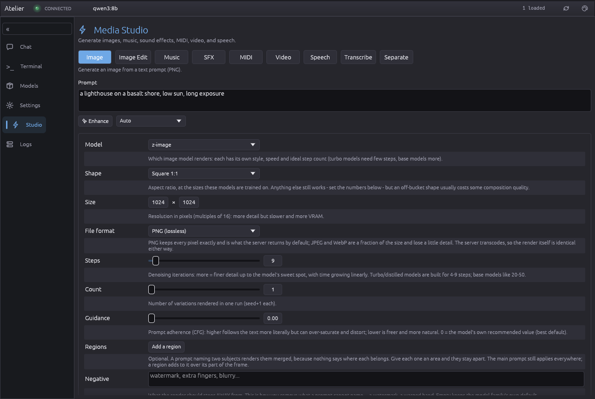
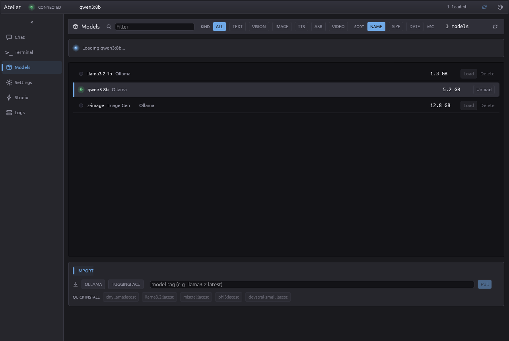
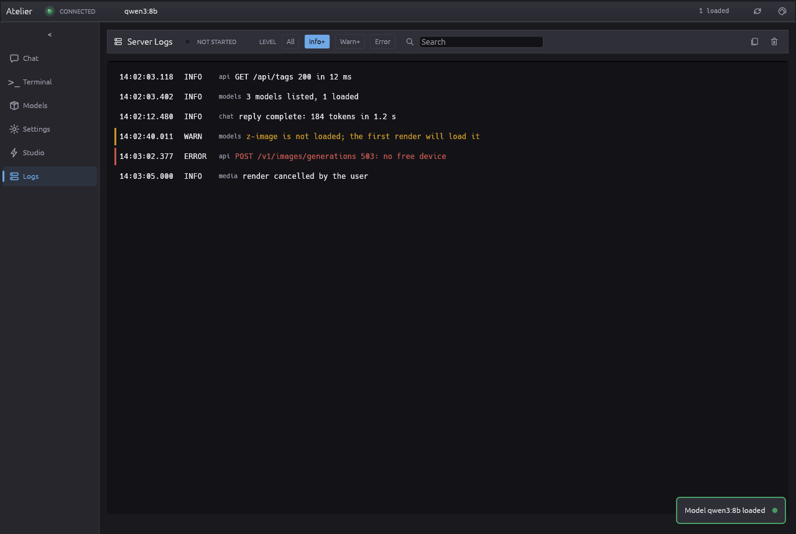

# atelier

The desktop client for [LOKEN](https://github.com/loken-ai/loken): a chat window, and a
studio for generating images, audio and video against models running on your own machine.

```sh
cargo build --release      # target/release/atelier
```

It talks to the server over HTTP and holds no model itself, so it runs on a laptop while the
work happens on the box with the cards.









The images are rendered by the test suite from state written in `src/screenshots.rs`, so they
show the current layout and can show no real address, path or prompt. Regenerate them with
`cargo test --release screenshots -- --ignored`.

## What is in it

- **Chat**, with streaming, image attachments for vision models, and speech in through the
  same affordance.
- **Media Studio** - image, image editing, audio, speech, video and transcription, each kind
  owning its own parameters so switching between them keeps what you set.
- **A viewer** for what comes back: fullscreen, zoom, and a strip of earlier generations that
  a new run does not wipe.
- **A model list, a terminal and the server's own log**, for loading, pulling and reading what
  the server says while it works.

What each machine in a cluster is doing is not here: it lives in
[atlas](https://github.com/loken-ai/atlas). One machine's view of its own cards could never
show the others.

## Where it is careful

- **Playback is in-process.** Handing audio to a system player makes the transport mean
  something different on every platform - pause becomes killing a process, seeking becomes
  restarting from a temporary file, and the position drifts. The samples are decoded here and
  handed to the operating system's audio device.
- **Video decodes as it plays.** Decoding a clip up front costs hundreds of megabytes before
  the first picture appears, and the wait grows with the length of the clip. This keeps the
  packets and produces pictures around the playhead.
- **A cost estimate before a render, not after.** Video is the one kind where the answer can
  be an hour, which is not something to discover by waiting.
- **Contrast is a test, not an intention.** Muted text is pinned against the WCAG AA floor on
  both the background and the card surface, in both themes, so a palette change cannot quietly
  take fifty sites under it.

## Build requirements

Linux needs the ALSA development headers (`libasound2-dev`) for in-process audio; Windows and
macOS need no system package. `--no-default-features` builds without audio output, and the
transport then says so rather than behaving differently.

## Licence

MIT OR Apache-2.0, at your option.
